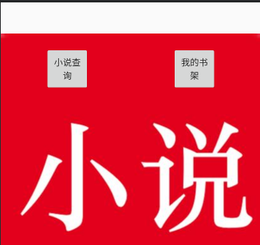

# 实验三

## 一、实验目标

1. 了解Android应用中各种资源的概念与使用方法；
2. 掌握在Android应用中使用图片等资源的方法。

## 二、实验内容

1. 在界面上显示至少一张图片（按照自己的题目添加）；
2. 提交res/drawable及图片使用的代码；
3. 提交res/values, res/layout等其他代码；
4. 将应用运行结果截图，放到实验报告中；
5. 点击图片（或按钮）时，打开另一个Activity。

## 三、实验步骤

1. 将图片放到res文件drawable 文件夹下；

   

2. 在activity_main.xml添加代码将图片放入 ;

   ```xml
   <TextView
       android:id="@+id/textview_01"
       android:layout_width="wrap_content"
       android:layout_height="wrap_content"
       android:drawableTop="@drawable/tupian"
       app:layout_constraintBottom_toBottomOf="parent"
       app:layout_constraintStart_toStartOf="parent"
       app:layout_constraintTop_toTopOf="parent"
       app:layout_constraintVertical_bias="0.232" />
   ```

## 四、实验结果




## 五、实验心得

本次实验主要学习了将图片置入界面的方法，总体来说难度不大。