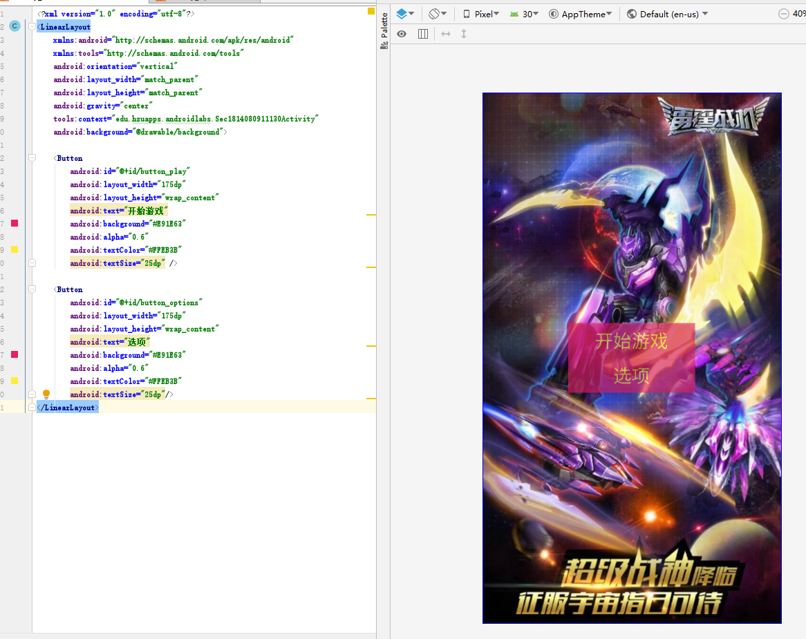

# 一、实验目标

1. 根据选题要求设计界面布局及控件使用；
2. 布局xml及界面控制操作代码提交并截图；
3. 将应用运行结果截图。

# 二、实验内容

1.developer.android.google.cn - 文档 - 核心主题 - 界面 - 布局
2.教材：第 2 章 P27-33

# 三、实验步骤

1. 主界面activity_sec1814080911130.xml采用LinearLayout布局，主要设置了2个button，并使用OnClickListener事件监听器以及openActivity方法实现各界面的跳转。

```xml
<?xml version="1.0" encoding="utf-8"?>
<LinearLayout
    xmlns:android="http://schemas.android.com/apk/res/android"
    xmlns:tools="http://schemas.android.com/tools"
    android:orientation="vertical"
    android:layout_width="match_parent"
    android:layout_height="match_parent"
    android:gravity="center"
    tools:context="edu.hzuapps.androidlabs.Sec1814080911130Activity"
    android:background="@drawable/background">

    <Button
        android:id="@+id/button_play"
        android:layout_width="175dp"
        android:layout_height="wrap_content"
        android:text="开始游戏"
        android:background="#E91E63"
        android:alpha="0.6"
        android:textColor="#FFEB3B"
        android:textSize="25dp" />

    <Button
        android:id="@+id/button_options"
        android:layout_width="175dp"
        android:layout_height="wrap_content"
        android:text="选项"
        android:background="#E91E63"
        android:alpha="0.6"
        android:textColor="#FFEB3B"
        android:textSize="25dp"/>
</LinearLayout>
```

   

2. 对按钮函数进行封装。

```java
public class Sec1814080911130Activity extends AppCompatActivity {
    public static final String TAG = Sec1814080911130Activity.class.getSimpleName();
    @Override
    protected void onCreate(Bundle savedInstanceState) {
        super.onCreate(savedInstanceState);
        setContentView(R.layout.activity_sec1814080911130);
        prepareExampleButton(R.id.button_play);
        prepareExampleButton(R.id.button_options);

    }

    private void openActivity(Activity activity, Class activityClass) {
        Intent intent = new Intent(activity, activityClass);
        activity.startActivity(intent);
    }


    private void prepareExampleButton(final int buttonId) {
        final Activity thisActivity = this;
        Button button = (Button) findViewById(buttonId);
        if (button != null) {
            button.setOnClickListener(new View.OnClickListener() {
                @Override
                public void onClick(View view) {
                    openActivity(thisActivity, getActivity(buttonId));
                }
            });
        } else {
            Log.e(TAG, "按钮不存在: " + buttonId);
        }
    }
    private Class getActivity(int id) {
        if (R.id.button_play == id) {
            return PlayActivity.class;
        } else if (R.id.button_options == id) {
            return OptionsActivity.class;
        } else {
            Log.e(TAG, "找不到ID: " + id);
            return Sec1814080911130Activity.class;
        }
    }
}
```

# 四、实验结果



# 五、实验心得

本次实验主要是实现界面的设计，实验过程需要花些时间思考。根据个人的项目需要，主界面选择线性布局，改了字体颜色。对按钮函数封装。